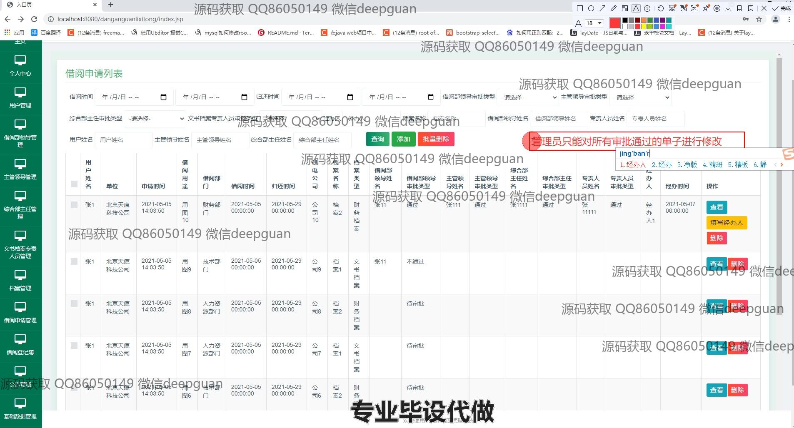
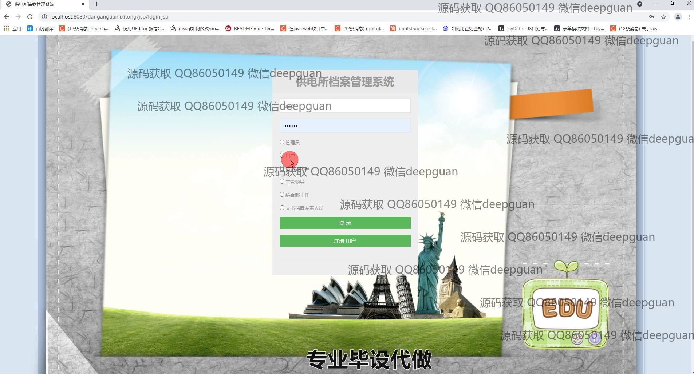
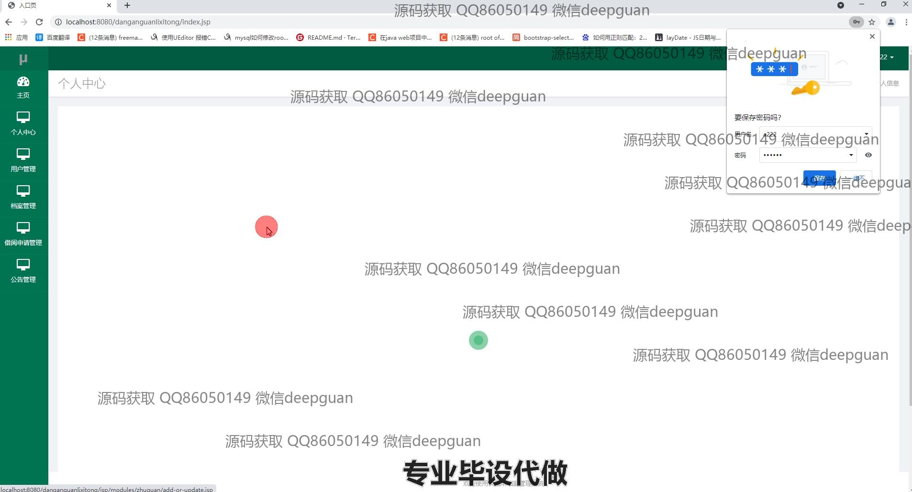
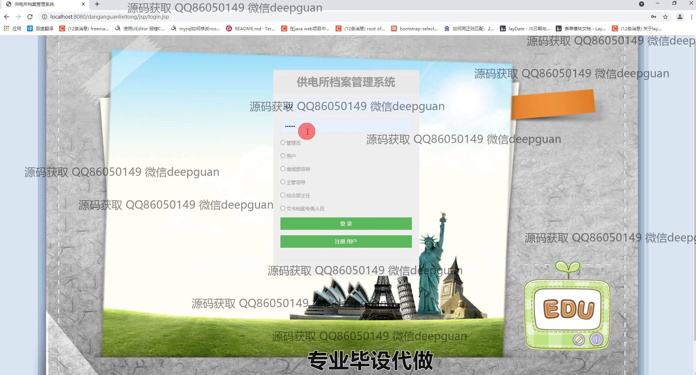
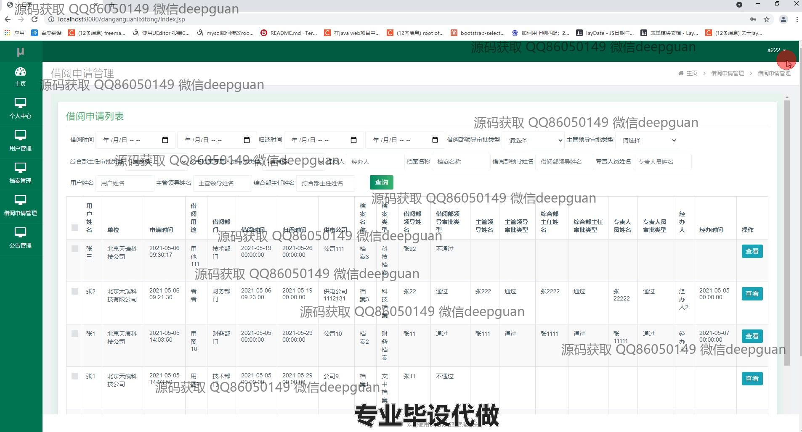

<h1 align="center">基于多层架构的供电所档案管理系统</h1>

## 简介
供电所档案管理系统：角色分为管理员、用户；支持用户管理、档案管理、借阅申请管理、公告管理、档案审核、信息查询及审批等功能。    --计算机毕业设计源码；毕设源码；java毕业设计源码

## 联系方式

<h3 align="center">获取完整代码与数据库文件 + 微信：deepguan QQ: 86050149 QQ群: 783742310</h3>

<h3 align="center">可帮忙远程部署 包运行成功！提供远程部署、修改代码、设计文档指导、代码讲解等服务！</h3>

## 功能介绍（完整见运行截图）
管理员：系统管理员可以登录并注册用户账户，管理网站的首页和各项功能模块，如用户管理、档案管理、公告管理等。他们负责监督和控制档案的借阅申请流程，处理用户的审核信息，并维护系统的正常运行。此外，管理员可以管理借阅纪录和用户信息，包括添加、删除、查看以及修改和重置密码。

普通用户：普通用户可以通过系统登录界面进入个人中心，查看和修改自己的个人信息。用户的权限通常允许他们查询和申请档案的借阅，还可以查看公告信息和通知。他们可以在页面上提交或取消档案借阅申请，并跟踪申请审核状态，上传借阅相关文件，同时获取档案的详细信息用于参考。

审核领导：审核领导主要负责查看和审批用户提交的档案借阅申请。通过系统中的审核界面，领导可以选择审核类型，上传相关文件，编辑和提交审批意见。他们可以筛选并查看借阅申请的详细记录，根据档案的具体信息决定审核是否通过，并将审核状态更新在系统中。

供电所领导：供电所领导可以访问系统中的主要功能模块，如档案管理、用户管理和公告管理等。作为高权限用户，他们可以浏览和审批涉及公司档案的操作，管理重要文档的信息安全，确保档案的借阅和存取符合公司规章制度。同时，他们可以发布和管理系统中的公告，向其他用户展示重要通知和信息。

## 运行截图

本代码来源于网络,仅供学习参考使用!

